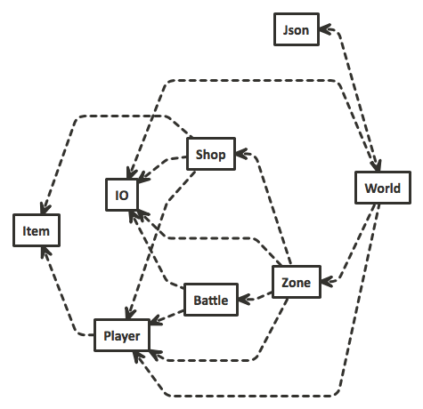

# Overview

We are going to create a __text-based battle game__. The battles are pokemon style, but without the ability to switch between pokemon (you have only one character). The game consists of progressing through battles in several zones. Each zone has a series of battles and a shop containing items, which enhance the player's stats and define what abilities they can use. Completion of each battle will earn the player money to buy new items. Each battle also increases experience, which lead to level-ups that increase stats.

## Key Features

* Money and Experience earned from defeating enemies

* Shops that sell items that player can equip to become stronger

* Turn-based battle series against AIs

* Multiple stages of increasing difficulty that each have a shop and battle series

* Items that increase stats and give new abilities to use in battle

* Ability to save game and load later to resume play

## Gameplay

The game will consist of three modes: battling, shopping, and traveling. The function of each mode from the player's perspective is discussed in the following sections.

### Battle

Battling is turn-based a la pokemon. At the beginning of each turn, the player will either pick an ability or consumable item to use, and the enemy AI will respond with a move of its own.  The battle ends when either the player or AI loses all their health. If the player dies, the game will revert back to the state it was in right before the battle was started. Upon defeating an enemy, the player will gain experience and money based on the difficulty and nature of that enemy, and unlock the next battle.

### Shop

In between battles, the player will have the ability to spend their money buying consumable and equippable items from the shop. Consumable items can be used during battles to assist the player, while equippable items add attacks to the player's abilities and change their stats. Items cost set amounts of money, and can be sold back to the shop at a reduced cost. 

The player's abilities will be determined by their equipped items and stats (example: health, strength, dexterity, magic, speed), which each affect certain aspects of battling. The player will level up as they gain experience. Every time they level up, the player will be given a certain amount of points that they can assign to improve their stats. These can be reset and reassigned for a cost at any point in the game.

### Travel

A series of locations will define the story line of the game, each with their own shop and series of battles. Winning the final battle of a location will unlock the next, and winning the final battle of the final location will win the game. Players can return to any previously-completed location at any point of the game, and fight any previously-won battle in order to gain money and experience. The locations will contain progressively-harder enemies as the player advances, and their shops will contain better and more expensive items. 

# Architecture

The basic architecture is identical to that of A2. A game is defined in a json file. The game engine reads this file and runs the game, interacting with the player as needed. We additionally allow the changing game state to be saved to a json file.

## Modules

The four main modules are `World`, `Zone`, `Battle`, and `Shop`. The first two support the travel mode and general organization, while the second two support the respective game modes. We additionally have `Player` and `Item` modules, which function mostly for data representation. Finally, we have `Json` and `IO` to handle the connections between components. A module dependency diagram is provided in figure 2.

### World

The world module handles all of the data in the game and holds the entire current game state.  The world is initialized at the beginning of the game by the Json module.  It will contain the starting player and a list of zones for the player to enter. The `enter_world` function in world is a REPL which prompts the user to either `quit`, `load`, `save` or `enter zone`. At first, only the first zone will be unlocked, however as the game progresses, the user will have the ability to travel between any zone that they unlock. A new zone becomes unlocked if the player returns from a zone which they have fully completed. When the user beats the game, the entire `enter_world` function returns true and exits.  If the user tries to save, the World module will call the save method from the Json module and pass in the current world state. The user can also load an old game which will cause the load method from the Json module to be called with the entered file name.

### Zone

The zone module is the module that contains the battle and shop modes of the game. The Zone allows a user to enter a battle using the `enter_battle` command and passing it a battle and player record. The zone module also allows a user to enter a shop by using the `enter_shop` command and passing it a shop and player record. The user exits the zone by returning a new `player` record as well as a boolean to say whether the zone has been completed. 

Zone depends directly on the `Player`, `Battle`, and `Shop` modules. Zone depends on `Battle` and `Shop` because each zone has battles and a shop that are unique and specific to that zone. The zone is also dependent on `Player` as it is necessary to pass a player record into a battle or shop. The zone module also depends on the `IO` module because it requires user input to operate. The main function in zone is a REPL which represents the player and the options to navigate to either the battle or shop mode.

### Battle

The battle module is the master module for the battle mode of the game. The module interfaces with `Zone` through the `enter_battle` command, which takes a `battle` record and a `player` record, returning a `player option`. If the battle is won, the new player is returned with increased experience and any consumed items removed. If the battle is lost, `None` is returned, and the Zone module resets to the state before the battle was begun.

Battle depends on `Player` and `Item` because stats (e.g. health) are determined by the player and abilities (e.g. slash) are determined by the equipped items. Battle also depends on `IO` because it involves player interaction. The main function in battle is a REPL which presents the player with the state of the battle and asks for a decision to use an ability or a consumable item.

### Shop

The shop module is the interface where the player can buy and manage items to improve their effectiveness in combat. This is also where they manage their inventory and equipped items/abilities/stats. Each zone has one shop, and the contents of that shop are unlimited, but will not change as the game progresses. Harder zones will have shops with better items. When buying an item, the player will pay its value; when selling they will receive 33% of the item's value. Its functions take the player and an item and modify the player's money/inventory/equipped to correspond with the action of the player. It will have its own repl to manage all of this.

### Player

The player module keeps track of all the player's information throughout the game. When playing the game, transitions between modes of the game will be implemented by passing the player to a function, which will return a new version of the player with all the changes made in that visit of the mode. The player is implemented as a record type with the fields stats: a player's current stats; inventory: a list of all the items the player is carrying; equipped: a list of all the items the player has equipped;  money: the amount of money the player currently has; experience: an integer keeping track of the player's experience; and level: the current level of the player. 

Helper functions in player will return information that may be used by other modules such as battle and shop for convenience.

### Item

The item module defines items, which determine the player's stats and abilities. An item can either be equippable (where it can give the player abilities, and boost stats while worn in a designated slot) or consumable (where it can be used in battle in place of a turn and will have an effect on the player and/or opponent for a certain amount of turns). Either type will have a `value` field, `name` field, and `description` field. It has multiple sub-types, including `stats`: information that dictates the player's performance in battle; `effect`: information about how an ability affects a character; `ability`: an ability, defined by its effects on both the caller and opponent; `equip_slot`: a variant that defines what slots items can be equipped in (each slot can only hold 1 item); `equip_stats`: information about equippable items; and `consume_stats`: information about consumable items.

### Json

The Json module is responsible for all of the loading and saving of data. It depends on the `Yojson` module to parse and create json files. At the very beginning of a new game, the json module will parse an init.json file and create a world state object. The json module will be laid out in the same hierarchical structure as the game objects. Whenever the player is in travel mode, she can save the game. This involves writing a new json file, the exact inverse process of reading one.

### IO

This module handles all interaction with the user. It is currently very minimal, but we include it as a module in case common use patterns emerge.

### Labor

Bryan: Helped plan general game design and gameplay. Designed item, shop, and player. Implemented parts of item and player that interfaced with shop. Implemented functionality of shop. Designed and created expansive item catalog with different catagories of items based on player styles and increasing difficulty. Made all of the json files for all of the items.

